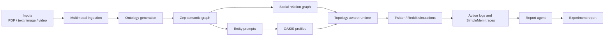

<div align="center">


# LightWorld

**A lightweight multi-modal social simulation engine for public-event analysis, topology-aware runtime scheduling, memory-efficient execution, and report generation.**

[](https://jaylzhou.github.io/LightWorld/)
[](backend/pyproject.toml)
[](LICENSE)
[](backend/app/run/api.py)
[](#what-lightworld-does)

[Project Site](https://jaylzhou.github.io/LightWorld/) ·
[Architecture](https://jaylzhou.github.io/LightWorld/architecture.html) ·
[User Guide](https://jaylzhou.github.io/LightWorld/guide.html) ·
[Examples](https://jaylzhou.github.io/LightWorld/examples.html)

</div>

---

## What LightWorld Does

LightWorld turns real-world event materials into an inspectable social simulation pipeline. It ingests documents, images, videos, and graph signals, compiles them into ontology and relation artifacts, prepares platform-ready agent profiles, runs Twitter/Reddit-style OASIS simulations, and generates reports that can be inspected after the run.

```text
event materials
  -> multimodal ingestion
  -> ontology and graph build
  -> entity prompts and platform profiles
  -> topology-aware simulation runtime
  -> memory traces, action logs, reports
```

It is designed for scenarios where the question is not only "what does the model answer?", but also "which entities were modeled, who influenced whom, what actions happened, and which artifacts can we inspect afterward?"

## Why It Is Different

| Layer | What it adds | Why it matters |
| --- | --- | --- |
| Multi-modal ingestion | PDF, text, image, and video inputs | Events are not forced into text-only context. |
| Graph construction | Ontology, entities, edges, and graph IDs | Simulation state is grounded in structured event context. |
| Lightweight memory | SimpleMem-style incremental state | The runtime keeps useful traces without replaying everything. |
| Topology-aware scheduling | Representative units and neighborhood activation | The simulation avoids blindly activating every agent every round. |
| Directed influence | PPR-based asymmetric influence signals | Influence can be read as directional instead of symmetric. |
| Report generation | Structured run artifacts and public reports | Outputs are inspectable beyond the final narrative. |

## Repository Snapshot

The public site currently presents one concrete case study from the repository: a Wuhan University reputation simulation experiment. These numbers are used as readable signals, not as benchmark claims.

| Signal | Value |
| --- | ---: |
| Input characters processed | 20,833 |
| Simulation entities | 31 |
| Topology units compiled | 29 |
| Total recorded actions | 564 |
| Twitter actions | 292 |
| Reddit actions | 272 |
| Memory writes | 295 |
| Example asymmetric influence | 0.129 vs 0.043 |

<p align="center">
  
  
  
  
</p>

## System Architecture



LightWorld keeps the static project site and the backend runtime deliberately separate. GitHub Pages hosts the project narrative, guide, architecture, and example pages; the Flask backend and long-running simulations must be run in a local or separately deployed runtime environment.

## Quick Start

### 1. Clone the repository

```bash
git clone https://github.com/JayLZhou/LightWorld.git
cd LightWorld
```

### 2. Configure secrets

```bash
cp .env.example .env
```

Set at least:

```bash
LLM_API_KEY=your_key
ZEP_API_KEY=your_key
```

Optional defaults are already present in `.env.example`:

```bash
LLM_BASE_URL=https://dashscope.aliyuncs.com/compatible-mode/v1
LLM_MODEL_NAME=qwen-plus
```

### 3. Install backend dependencies

```bash
cd backend
uv sync
```

### 4. Start the API service

```bash
uv run lightworld-api
```

By default, the Flask service reads `FLASK_HOST`, `FLASK_PORT`, and `FLASK_DEBUG` from the environment, with port `5001` as the default backend port.

### 5. Run the included end-to-end sample

```bash
cd backend
uv run lightworld-full-run \
  --config ../multimodal_inputs/baike_wuda_event/full_run.config.json
```

If you want a non-interactive topology clustering choice, pass one of the supported cluster modes:

```bash
uv run lightworld-full-run \
  --config ../multimodal_inputs/baike_wuda_event/full_run.config.json \
  --cluster-method threshold
```

## Command Palette

```bash
# Start the Flask backend.
cd backend
uv run lightworld-api

# Build a local multimodal graph pipeline.
uv run lightworld-local-pipeline --config ../multimodal_inputs/baike_wuda_event/local_pipeline_full.json

# Run a prepared simulation config.
uv run lightworld-parallel-sim --config /abs/path/to/simulation_config.json

# Run ingestion, preparation, simulation, and optional report generation.
uv run lightworld-full-run --config ../multimodal_inputs/baike_wuda_event/full_run.config.json
```

## Repository Layout

```text
LightWorld/
  backend/
    app/
      application/        # end-to-end orchestration services
      modules/graph/      # local multimodal graph pipeline
      modules/simulation/ # topology-aware runtime and platform runners
      run/                # CLI entry points exposed by pyproject scripts
      utils/              # ingestion, graph, profile, config, and report helpers
    run_scripts/          # compatibility and platform-specific runners
    input2graph/          # sample graph and experiment artifacts
  docs/                   # GitHub Pages project site
  multimodal_inputs/      # WHU multimodal demo package
  event_inputs/           # extracted event pipeline outputs
```

## Generated Artifacts

A full run can expose a consolidated run directory with links or copies to the important artifacts:

| Stage | Representative artifacts |
| --- | --- |
| Project build | `project.json`, `extracted_text.txt`, `parsed_content.json`, `source_manifest.json` |
| Simulation prep | `entity_prompts.json`, `entity_graph_snapshot.json`, `social_relation_graph.json`, `simulation_config.json` |
| Platform runtime | `twitter_profiles.csv`, `reddit_profiles.json`, `twitter_actions.jsonl`, `reddit_actions.jsonl` |
| Memory and topology | `simplemem_twitter.json`, `simplemem_reddit.json`, topology snapshots and traces |
| Reporting | `full_report.md`, `outline.json`, `agent_log.jsonl`, `console_log.txt` |

## Current Status

LightWorld is currently best understood as a repository-backed research and prototype system:

| Ready now | Not claimed yet |
| --- | --- |
| Static GitHub Pages project site | Hosted public interactive backend |
| Backend API and CLI entry points | Fully managed cloud deployment |
| Multimodal WHU demo inputs | General-purpose benchmark suite |
| End-to-end local full-run service | Polished browser upload-and-run product |
| Experiment artifacts and summaries | Public video walkthrough |

## Development Notes

```bash
cd backend
uv sync --group dev
uv run pytest
```

The repository also includes targeted test scripts under `backend/test_scripts/` for individual pipeline modules.

## License

LightWorld is released under the [GNU Affero General Public License v3.0](LICENSE).

<div align="center">


</div>
