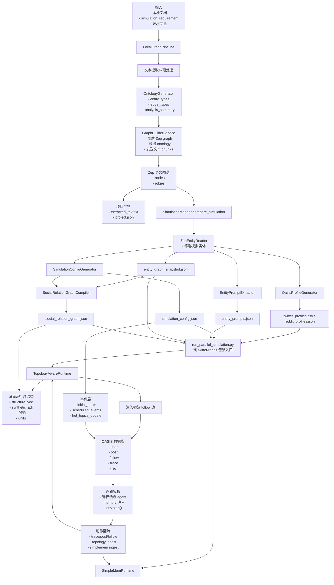

# 后端架构（重构版）

当前仓库已经是纯后端项目。

## 分层结构

- `backend/app/cli/`
  - 标准化 CLI 入口（API、本地图谱构建、并行模拟）
- `backend/app/core/`
  - 核心配置与运行时共享基础设施
- `backend/app/adapters/http/`
  - HTTP 适配层（Blueprint、请求处理、响应组装）
- `backend/app/application/`
  - 应用服务层，供 API 与脚本复用
- `backend/app/domain/`
  - 领域对象与状态管理（project/task/simulation）
- `backend/app/infrastructure/`
  - 基础设施工具（LLM client、日志、文件解析、分页、重试）
- `backend/app/modules/`
  - 以场景为中心的重构模块

## 主要模块

- `backend/app/modules/graph/local_pipeline.py`
  - `LocalGraphPipeline`：本地文档驱动的图谱构建流程
  - `LocalPipelineOptions`：本地管线输入参数
- `backend/app/modules/simulation/runtimes.py`
  - `TopologyAwareRuntime`：topology-aware 协调与差异化激活
  - `SimpleMemRuntime`：轻量增量记忆与检索注入
- `backend/app/modules/simulation/platform_runner.py`
  - `PlatformSpec`：平台差异配置
  - `run_platform_simulation`：Twitter / Reddit 共用运行主循环
  - `TWITTER_SPEC` / `REDDIT_SPEC`：平台规格实例

## 当前采用的设计模式

- Strategy
  - 平台差异通过 `PlatformSpec` 表达，而不是在运行主逻辑里堆分支。
- Application Service
  - 复杂用例由 `LocalGraphPipeline`、`SimulationManager`、`run_platform_simulation` 负责编排。
- Thin Entry Script
  - `scripts/run_local_pipeline.py` 与 `scripts/run_parallel_simulation.py` 主要负责 CLI 与参数转发。

## 运行入口

- API 服务
  - `cd backend && uv run mirofish-api`
- 本地图谱构建
  - `cd backend && uv run mirofish-local-pipeline ...`
- 并行模拟
  - `cd backend && uv run mirofish-parallel-sim --config <path>`

## 配置模板

- 完整 simulation 配置模板（包含 topology-aware、simplemem、light-mode）
  - `backend/scripts/config_templates/simulation_config.full.template.json`

## 兼容包装

- `backend/run.py` 与 `backend/scripts/run_local_pipeline.py`
  - 作为兼容入口保留。
- `backend/scripts/run_twitter_simulation.py` 与 `backend/scripts/run_reddit_simulation.py`
  - 现在已经改为委托统一入口 `run_parallel_simulation.py`
  - 分别通过 `--twitter-only` / `--reddit-only` 运行单平台模拟

## 端到端数据流

当前后端的真实路径不是简单的“文档 -> 图谱”或“profile -> OASIS”，而是下面这条完整链路：

1. 本地文档与 `simulation_requirement` 进入本地图谱构建管线。
2. 管线完成文本提取、预处理、ontology 生成与 Zep 语义图谱构建。
3. 从语义图谱中读回节点与边，并筛选出可模拟实体。
4. 围绕这些实体继续生成：
   - `entity_prompts`
   - OASIS `profiles`
   - `simulation_config`
   - 显式 `social_relation_graph`
5. 这些中间产物再被编译进 OASIS 运行时：
   - profile 文件用于创建 agent graph
   - simulation config 驱动时间、事件、topology、memory
   - social relation graph 被转成初始 `follow` 边注入 OASIS 数据库
6. 运行时动作继续回流到：
   - OASIS 数据库表
   - topology-aware 更新
   - SimpleMem

### 流程图

## 产物文件

### 项目构建阶段

产物目录：

- `backend/uploads/projects/<project_id>/`

主要文件：

- `extracted_text.txt`
  - 预处理后的项目级拼接文本
- `project.json`
  - 项目状态、ontology 摘要、graph id、图谱统计信息

### Simulation Prepare 阶段

产物目录：

- `backend/uploads/simulations/<simulation_id>/`

主要文件：

- `entity_graph_snapshot.json`
  - 过滤后的实体，以及与 simulation 相关的图谱边快照
- `entity_prompts.json`
  - 用于聚类 / 检索的实体语义蒸馏结果
- `twitter_profiles.csv` 或 `reddit_profiles.json`
  - OASIS 可直接读取的 profile 文件
- `simulation_config.json`
  - 时间配置、agent 配置、事件配置、topology 配置、memory 配置
- `social_relation_graph.json`
  - 显式 agent-agent 社交关系图，包含：
    - `exposure_weight`
    - `trust_weight`
    - `hostility_weight`
    - `alliance_weight`
    - `interaction_prior`

### Runtime 阶段

仍然产出在相同 simulation 目录下：

- `twitter_simulation.db` / `reddit_simulation.db`
  - OASIS 运行时数据库
- `simulation.log`
  - 主进程日志
- `env_status.json`
  - 环境生命周期状态
- `twitter/actions.jsonl` / `reddit/actions.jsonl`
  - 结构化动作日志
- `simplemem_twitter.json` / `simplemem_reddit.json`
  - 压缩后的增量记忆文件

## 示例说明

### 示例 1：最小 README 驱动建图

输入：

- 文档：`README.md`
- 需求：`Use README content to build a minimal public-opinion simulation`

输出过程：

1. `LocalGraphPipeline` 读取 `README.md`
2. `OntologyGenerator` 基于文档文本和需求生成 ontology
3. `GraphBuilderService` 构建 Zep 图谱
4. `project.json` 保存生成的 `graph_id`

一次成功运行得到：

- project 目录
  - `/home/shulun/project/LightWorld/backend/uploads/projects/proj_6d56e4817baf`
- graph id
  - `mirofish_9f0d1c84b2164adf`

### 示例 2：基于该图谱准备 simulation

输入：

- `project_id = proj_6d56e4817baf`
- `graph_id = mirofish_9f0d1c84b2164adf`
- 一个最小 Twitter smoke test 的 simulation requirement

prepare 阶段产物：

- simulation 目录
  - `/home/shulun/project/LightWorld/backend/uploads/simulations/sim_826a7c28a5eb`
- 关键文件
  - [`entity_graph_snapshot.json`](/home/shulun/project/LightWorld/backend/uploads/simulations/sim_826a7c28a5eb/entity_graph_snapshot.json)
  - [`entity_prompts.json`](/home/shulun/project/LightWorld/backend/uploads/simulations/sim_826a7c28a5eb/entity_prompts.json)
  - [`twitter_profiles.csv`](/home/shulun/project/LightWorld/backend/uploads/simulations/sim_826a7c28a5eb/twitter_profiles.csv)
  - [`simulation_config.json`](/home/shulun/project/LightWorld/backend/uploads/simulations/sim_826a7c28a5eb/simulation_config.json)
  - [`social_relation_graph.json`](/home/shulun/project/LightWorld/backend/uploads/simulations/sim_826a7c28a5eb/social_relation_graph.json)

这些文件各自的作用：

- `entity_graph_snapshot.json`
  - 语义图谱到 simulation 的桥接文件
- `entity_prompts.json`
  - 为 runtime 提供语义相似度与记忆检索提示
- `twitter_profiles.csv`
  - OASIS 创建 agents 时直接读取
- `simulation_config.json`
  - LightWorld 自己读取，用于驱动时间、事件、runtime 行为
- `social_relation_graph.json`
  - LightWorld 显式社交关系先验，后续会被编译成初始 follow 边

### 示例 3：运行时如何编译进 OASIS DB

当 runtime 启动时，流程是：

1. `twitter_profiles.csv` 被加载成 OASIS agent graph
2. `simulation_config.json` 启用：
   - topology-aware runtime
   - simple memory
   - initial posts
   - scheduled events
3. `social_relation_graph.json` 被 `TopologyAwareRuntime` 读取
4. 初始社交边被写入 OASIS 的 `follow` 表
5. 运行时动作继续写入：
   - `post`
   - `follow`
   - `trace`
   - `rec`

一次已经验证成功的单平台运行产生了：

- runtime DB
  - [`twitter_simulation.db`](/home/shulun/project/LightWorld/backend/uploads/simulations/sim_826a7c28a5eb/twitter_simulation.db)
- 环境状态文件
  - [`env_status.json`](/home/shulun/project/LightWorld/backend/uploads/simulations/sim_826a7c28a5eb/env_status.json)
- 主日志
  - [`simulation.log`](/home/shulun/project/LightWorld/backend/uploads/simulations/sim_826a7c28a5eb/simulation.log)

这次验证中可以明确看到：

- 初始 follow 边在 round loop 开始前已经被注入数据库
- 一个 `scheduled create_post` 事件被触发，并且真实写入了 `post` 表
- 一个 `hot_topics_update` 事件在运行时被触发

## 实际理解方式

要正确理解这套系统，最重要的是区分两类对象：

- `social_relation_graph.json`
  - LightWorld 自己维护的显式关系先验文件
- `twitter_simulation.db` / `reddit_simulation.db`
  - OASIS 真正执行时的世界状态数据库

运行时不是“把 JSON 直接喂给 OASIS 就结束了”。
更准确地说，LightWorld 先把自己的中间产物编译进 OASIS 状态里，
而真正执行模拟的底层世界，是数据库中的运行时状态。
